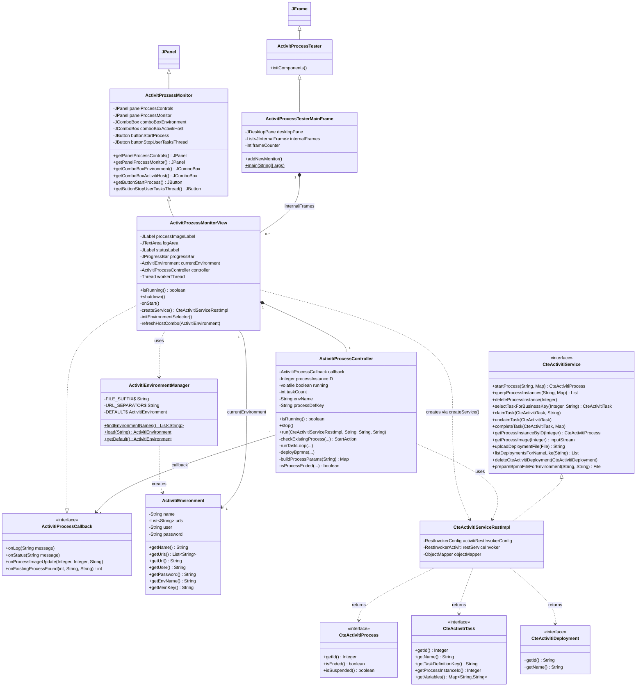
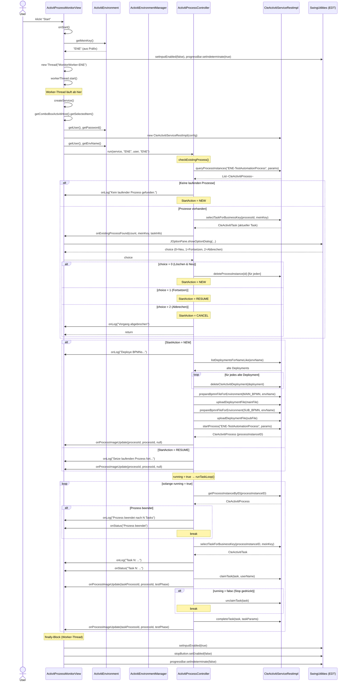

# Diagramme: activiti-process-6

## Klassendiagramm

```mermaid
classDiagram
    direction TB

    %% ── Swing-Basis ──────────────────────────────────────
    class JFrame
    class JPanel

    %% ── Design (JFormDesigner) ───────────────────────────
    class ActivitProcessTester {
        +initComponents()
    }
    JFrame <|-- ActivitProcessTester

    class ActivitProzessMonitor {
        -JPanel panelProcessControls
        -JPanel panelProcessMonitor
        -JComboBox comboBoxEnvironment
        -JComboBox comboBoxActivitiHost
        -JButton buttonStartProcess
        -JButton buttonStopUserTasksThread
        +getPanelProcessControls() JPanel
        +getPanelProcessMonitor() JPanel
        +getComboBoxEnvironment() JComboBox
        +getComboBoxActivitiHost() JComboBox
        +getButtonStartProcess() JButton
        +getButtonStopUserTasksThread() JButton
    }
    JPanel <|-- ActivitProzessMonitor

    %% ── GUI ──────────────────────────────────────────────
    class ActivitProcessTesterMainFrame {
        -JDesktopPane desktopPane
        -List~JInternalFrame~ internalFrames
        -int frameCounter
        +addNewMonitor()
        +main(String[] args)$
    }
    ActivitProcessTester <|-- ActivitProcessTesterMainFrame
    ActivitProcessTesterMainFrame "1" *-- "0..*" ActivitProzessMonitorView : internalFrames

    class ActivitiProcessCallback {
        <<interface>>
        +onLog(String message)
        +onStatus(String message)
        +onProcessImageUpdate(Integer, Integer, String)
        +onExistingProcessFound(int, String, String) int
    }

    class ActivitProzessMonitorView {
        -JLabel processImageLabel
        -JTextArea logArea
        -JLabel statusLabel
        -JProgressBar progressBar
        -ActivitiEnvironment currentEnvironment
        -ActivitiProcessController controller
        -Thread workerThread
        +isRunning() boolean
        +shutdown()
        -onStart()
        -createService() CteActivitiServiceRestImpl
        -initEnvironmentSelector()
        -refreshHostCombo(ActivitiEnvironment)
    }
    ActivitProzessMonitor <|-- ActivitProzessMonitorView
    ActivitiProcessCallback <|.. ActivitProzessMonitorView
    ActivitProzessMonitorView "1" *-- "1" ActivitiProcessController
    ActivitProzessMonitorView "1" --> "1" ActivitiEnvironment : currentEnvironment

    class ActivitiProcessController {
        -ActivitiProcessCallback callback
        -Integer processInstanceID
        -volatile boolean running
        -int taskCount
        -String envName
        -String processDefKey
        +isRunning() boolean
        +stop()
        +run(CteActivitiServiceRestImpl, String, String, String)
        -checkExistingProcess(...) StartAction
        -runTaskLoop(...)
        -deployBpmns(...)
        -buildProcessParams(String) Map
        -isProcessEnded(...) boolean
    }
    ActivitiProcessController "1" --> "1" ActivitiProcessCallback : callback

    %% ── Config ───────────────────────────────────────────
    class ActivitiEnvironment {
        -String name
        -List~String~ urls
        -String user
        -String password
        +getName() String
        +getUrls() List~String~
        +getUrl() String
        +getUser() String
        +getPassword() String
        +getEnvName() String
        +getMeinKey() String
    }

    class ActivitiEnvironmentManager {
        -FILE_SUFFIX$ String
        -URL_SEPARATOR$ String
        -DEFAULT$ ActivitiEnvironment
        +findEnvironmentNames()$ List~String~
        +load(String)$ ActivitiEnvironment
        +getDefault()$ ActivitiEnvironment
    }
    ActivitiEnvironmentManager ..> ActivitiEnvironment : creates

    %% ── Service ──────────────────────────────────────────
    class CteActivitiService {
        <<interface>>
        +startProcess(String, Map) CteActivitiProcess
        +queryProcessInstances(String, Map) List
        +deleteProcessInstance(Integer)
        +selectTaskForBusinessKey(Integer, String) CteActivitiTask
        +claimTask(CteActivitiTask, String)
        +unclaimTask(CteActivitiTask)
        +completeTask(CteActivitiTask, Map)
        +getProcessInstanceByID(Integer) CteActivitiProcess
        +getProcessImage(Integer) InputStream
        +uploadDeploymentFile(File) String
        +listDeploymentsForNameLike(String) List
        +deleteCteActivitiDeployment(CteActivitiDeployment)
        +prepareBpmnFileForEnvironment(String, String) File
    }

    class CteActivitiServiceRestImpl {
        -RestInvokerConfig activitiRestInvokerConfig
        -RestInvokerActiviti restServiceInvoker
        -ObjectMapper objectMapper
    }
    CteActivitiService <|.. CteActivitiServiceRestImpl

    ActivitiProcessController ..> CteActivitiServiceRestImpl : uses
    ActivitProzessMonitorView ..> CteActivitiServiceRestImpl : creates via createService()
    ActivitProzessMonitorView ..> ActivitiEnvironmentManager : uses

    %% ── Domain-Interfaces ────────────────────────────────
    class CteActivitiProcess {
        <<interface>>
        +getId() Integer
        +isEnded() boolean
        +isSuspended() boolean
    }
    class CteActivitiTask {
        <<interface>>
        +getId() Integer
        +getName() String
        +getTaskDefinitionKey() String
        +getProcessInstanceId() Integer
        +getVariables() Map~String,String~
    }
    class CteActivitiDeployment {
        <<interface>>
        +getId() String
        +getName() String
    }

    CteActivitiServiceRestImpl ..> CteActivitiProcess : returns
    CteActivitiServiceRestImpl ..> CteActivitiTask : returns
    CteActivitiServiceRestImpl ..> CteActivitiDeployment : returns
```

---

## Sequenzdiagramm: `ActivitProzessMonitorView#onStart`

```mermaid
sequenceDiagram
    actor User
    participant View as ActivitProzessMonitorView
    participant Env as ActivitiEnvironment
    participant EnvMgr as ActivitiEnvironmentManager
    participant Ctrl as ActivitiProcessController
    participant Svc as CteActivitiServiceRestImpl
    participant EDT as SwingUtilities (EDT)

    User->>View: klickt "Start"
    View->>View: onStart()
    View->>Env: getMeinKey()
    Env-->>View: "ENE" (aus Präfix)

    View->>EDT: setInputEnabled(false), progressBar.setIndeterminate(true)
    View->>View: new Thread("MonitorWorker-ENE")
    View->>View: workerThread.start()

    Note over View: Worker-Thread läuft ab hier

    View->>View: createService()
    View->>View: getComboBoxActivitiHost().getSelectedItem()
    View->>Env: getUser(), getPassword()
    View->>Svc: new CteActivitiServiceRestImpl(config)

    View->>Env: getUser(), getEnvName()
    View->>Ctrl: run(service, "ENE", user, "ENE")

    Note over Ctrl: checkExistingProcess()
    Ctrl->>Svc: queryProcessInstances("ENE-TestAutomationProcess", params)
    Svc-->>Ctrl: List~CteActivitiProcess~

    alt Keine laufenden Prozesse
        Ctrl->>View: onLog("Kein laufender Prozess gefunden.")
        Note over Ctrl: StartAction = NEW
    else Prozesse vorhanden
        Ctrl->>Svc: selectTaskForBusinessKey(processId, meinKey)
        Svc-->>Ctrl: CteActivitiTask (aktueller Task)
        Ctrl->>View: onExistingProcessFound(count, meinKey, taskInfo)
        View->>EDT: JOptionPane.showOptionDialog(...)
        EDT-->>View: choice (0=Neu, 1=Fortsetzen, 2=Abbrechen)
        View-->>Ctrl: choice

        alt choice = 0 (Löschen & Neu)
            Ctrl->>Svc: deleteProcessInstance(id) [für jeden]
            Note over Ctrl: StartAction = NEW
        else choice = 1 (Fortsetzen)
            Note over Ctrl: StartAction = RESUME
        else choice = 2 (Abbrechen)
            Note over Ctrl: StartAction = CANCEL
            Ctrl->>View: onLog("Vorgang abgebrochen")
            Ctrl-->>View: return
        end
    end

    alt StartAction = NEW
        Ctrl->>View: onLog("Deploye BPMNs...")
        Ctrl->>Svc: listDeploymentsForNameLike(envName)
        Svc-->>Ctrl: alte Deployments
        loop für jedes alte Deployment
            Ctrl->>Svc: deleteCteActivitiDeployment(deployment)
        end
        Ctrl->>Svc: prepareBpmnFileForEnvironment(MAIN_BPMN, envName)
        Ctrl->>Svc: uploadDeploymentFile(mainFile)
        Ctrl->>Svc: prepareBpmnFileForEnvironment(SUB_BPMN, envName)
        Ctrl->>Svc: uploadDeploymentFile(subFile)
        Ctrl->>Svc: startProcess("ENE-TestAutomationProcess", params)
        Svc-->>Ctrl: CteActivitiProcess (processInstanceID)
        Ctrl->>View: onProcessImageUpdate(processId, processId, null)
    else StartAction = RESUME
        Ctrl->>View: onLog("Setze laufenden Prozess fort...")
        Ctrl->>View: onProcessImageUpdate(processId, processId, null)
    end

    Note over Ctrl: running = true → runTaskLoop()

    loop solange running = true
        Ctrl->>Svc: getProcessInstanceByID(processInstanceID)
        Svc-->>Ctrl: CteActivitiProcess

        alt Prozess beendet
            Ctrl->>View: onLog("Prozess beendet nach N Tasks")
            Ctrl->>View: onStatus("Prozess beendet")
            Note over Ctrl: break
        end

        Ctrl->>Svc: selectTaskForBusinessKey(processInstanceID, meinKey)
        Svc-->>Ctrl: CteActivitiTask

        Ctrl->>View: onLog("Task N: ...")
        Ctrl->>View: onStatus("Task N: ...")
        Ctrl->>Svc: claimTask(task, userName)
        Ctrl->>View: onProcessImageUpdate(taskProcessId, processId, testPhase)

        alt running = false (Stop gedrückt)
            Ctrl->>Svc: unclaimTask(task)
            Note over Ctrl: break
        end

        Ctrl->>Svc: completeTask(task, taskParams)
        Ctrl->>View: onProcessImageUpdate(taskProcessId, processId, testPhase)
    end

    Note over View: finally-Block (Worker-Thread)
    View->>EDT: setInputEnabled(true)
    View->>EDT: stopButton.setEnabled(false)
    View->>EDT: progressBar.setIndeterminate(false)
```
